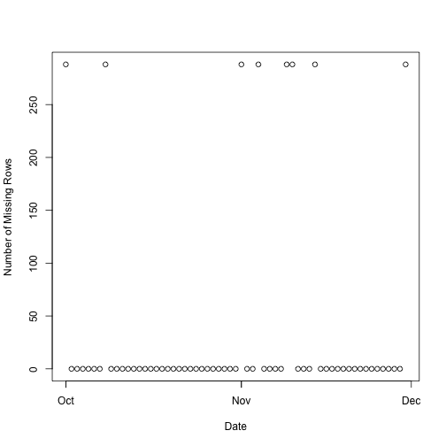

We will use tools from  R packages.

```r
library(knitr)
library(dplyr)
```

```
## 
## Attaching package: 'dplyr'
## 
## The following objects are masked from 'package:lubridate':
## 
##     intersect, setdiff, union
## 
## The following objects are masked from 'package:stats':
## 
##     filter, lag
## 
## The following objects are masked from 'package:base':
## 
##     intersect, setdiff, setequal, union
```

```r
library(lubridate)
setwd('/Users/vudinh/Desktop/Data Science - Coursera/Reproducible Research 2015/RepData_PeerAssessment1')
```

### Import 'activity' dataset
  We want to transform **date** to a time data type and call it **day**. Then the data frame table used for   analysis below will be "activity".

```r
temp <- tempfile()
download.file("https://d396qusza40orc.cloudfront.net/repdata%2Fdata%2Factivity.zip",temp)
mydf <- read.csv(unzip(temp))
#mydf <- read.csv("~/Desktop/Data Science - Coursera/Reproducible Research 2015/activity.csv")
tbl_df(mydf)
```

```
## Source: local data frame [17,568 x 3]
## 
##    steps       date interval
##    (int)     (fctr)    (int)
## 1     NA 2012-10-01        0
## 2     NA 2012-10-01        5
## 3     NA 2012-10-01       10
## 4     NA 2012-10-01       15
## 5     NA 2012-10-01       20
## 6     NA 2012-10-01       25
## 7     NA 2012-10-01       30
## 8     NA 2012-10-01       35
## 9     NA 2012-10-01       40
## 10    NA 2012-10-01       45
## ..   ...        ...      ...
```

```r
activity <- mutate(tbl_df(mydf), day = ymd(date))
activity <- select(activity, steps, interval, day)
```

## What is mean total number of steps taken per day? 
  For this part of the assignment, we ignore the missing values in the dataset.The mean number of steps is 10766 steps.

```r
by_day <- group_by(activity, day)
monthly_walking_pattern <- summarize(by_day, daily_total=sum(steps))
```


### 1. Histogram 

```r
hist(monthly_walking_pattern$daily_total, xlab= 'Daily Total Steps',main = 'Total Number of Steps taken Each Day')
```

 

### 2. Calculate and report the mean and median total number of steps taken per day.

```r
summarize(monthly_walking_pattern, average = mean(daily_total, na.rm=TRUE), median = median(daily_total, na.rm = TRUE))
```

```
## Source: local data frame [1 x 2]
## 
##    average median
##      (dbl)  (int)
## 1 10766.19  10765
```

##What is the average daily activity pattern?

###1. Time Series Plot 


```r
by_interval <- group_by(activity, interval)
daily_walking_pattern <- summarize(by_interval, Number_of_Steps = mean(steps, na.rm = TRUE))
plot(daily_walking_pattern, type = 'l', xlab = '5-Minute Interval', ylab = 'Ave Steps Taken')
```

 

###2. Maximum *activity* at 8:35AM
  The 5-minute interval corresponding to around 8:35 AM - average across all the days in the dataset - contains the maximum number of steps: approximately 206 steps.


```r
filter(daily_walking_pattern, Number_of_Steps == max(Number_of_Steps))
```

```
## Source: local data frame [1 x 2]
## 
##   interval Number_of_Steps
##      (int)           (dbl)
## 1      835        206.1698
```

##Imputing missing values

###1. 2304 rows of missing data 
  The plot shows the missing data resides in 8 days across two months. 288*8=2304


```r
missing <- filter(activity, is.na(steps)==TRUE) 
missing
```

```
## Source: local data frame [2,304 x 3]
## 
##    steps interval        day
##    (int)    (int)     (time)
## 1     NA        0 2012-10-01
## 2     NA        5 2012-10-01
## 3     NA       10 2012-10-01
## 4     NA       15 2012-10-01
## 5     NA       20 2012-10-01
## 6     NA       25 2012-10-01
## 7     NA       30 2012-10-01
## 8     NA       35 2012-10-01
## 9     NA       40 2012-10-01
## 10    NA       45 2012-10-01
## ..   ...      ...        ...
```

```r
miss_data<- summarize(by_day, count=n(), missing_int = sum(is.na(steps)))
plot(miss_data$day,miss_data$missing_int, ylab = 'Number of Missing Rows', xlab='Date')
```

 

###2. Strategy for filling in the missing values
  We will use the **mean number of steps for the corresponding 5-minute** interval to impute the missing values. The complete dataset will be named *activity_imputed*.


```r
fill_with <- summarize(by_interval, Number_of_Steps = mean(steps, na.rm = TRUE))
activity_imputed <- activity
i=1
while( i <= nrow(missing))
{   
  missing[i,1] = fill_with[which(fill_with$interval==as.numeric(missing[i,2])),2]
  i= i+1
}

activity_imputed[is.na(activity$steps),1] = missing[,1]
activity_imputed
```

```
## Source: local data frame [17,568 x 3]
## 
##        steps interval        day
##        (dbl)    (int)     (time)
## 1  1.7169811        0 2012-10-01
## 2  0.3396226        5 2012-10-01
## 3  0.1320755       10 2012-10-01
## 4  0.1509434       15 2012-10-01
## 5  0.0754717       20 2012-10-01
## 6  2.0943396       25 2012-10-01
## 7  0.5283019       30 2012-10-01
## 8  0.8679245       35 2012-10-01
## 9  0.0000000       40 2012-10-01
## 10 1.4716981       45 2012-10-01
## ..       ...      ...        ...
```

```r
summary(activity_imputed)
```

```
##      steps           interval           day            
##  Min.   :  0.00   Min.   :   0.0   Min.   :2012-10-01  
##  1st Qu.:  0.00   1st Qu.: 588.8   1st Qu.:2012-10-16  
##  Median :  0.00   Median :1177.5   Median :2012-10-31  
##  Mean   : 37.38   Mean   :1177.5   Mean   :2012-10-31  
##  3rd Qu.: 27.00   3rd Qu.:1766.2   3rd Qu.:2012-11-15  
##  Max.   :806.00   Max.   :2355.0   Max.   :2012-11-30
```


### Revised analysis with imputed dataset.
  Using the imputed dataset, we see that the **mean** and the **median** daily total number of steps are the same. This was not the case with the missing data. Filling in the missing values with the average has made the distribution of *steps* across *intervals* more symmetric, i.e., less skewed.


```r
by_day <- group_by(activity_imputed, day)
monthly_walking_pattern_imputed <- summarize(by_day, daily_total=sum(steps))
hist(monthly_walking_pattern_imputed$daily_total, xlab= 'Daily Total Steps',main = 'Total Number of Steps taken Each Day (imputed data)')
```

 

```r
summarize(monthly_walking_pattern_imputed, average = mean(daily_total), median = median(daily_total))
```

```
## Source: local data frame [1 x 2]
## 
##    average   median
##      (dbl)    (dbl)
## 1 10766.19 10766.19
```


###Are there differences in activity patterns between weekdays and weekends?
  Comparison of the two time series plots below shows that, on the weekends, there are more *activity* through out the 24 hours period. 

```r
activity_imputed <- mutate(activity_imputed, weekend = weekdays(day)=="Sunday"|weekdays(day)=="Saturday")
summary(activity_imputed)
```

```
##      steps           interval           day              weekend       
##  Min.   :  0.00   Min.   :   0.0   Min.   :2012-10-01   Mode :logical  
##  1st Qu.:  0.00   1st Qu.: 588.8   1st Qu.:2012-10-16   FALSE:12960    
##  Median :  0.00   Median :1177.5   Median :2012-10-31   TRUE :4608     
##  Mean   : 37.38   Mean   :1177.5   Mean   :2012-10-31   NA's :0        
##  3rd Qu.: 27.00   3rd Qu.:1766.2   3rd Qu.:2012-11-15                  
##  Max.   :806.00   Max.   :2355.0   Max.   :2012-11-30
```

```r
weekend_days <- filter(activity_imputed, weekend == TRUE)
weekday_days <- filter(activity_imputed, weekend == FALSE)

by_interval_weekend_days <- group_by(weekend_days,interval)
by_interval_weekday_days <- group_by(weekday_days,interval)

weekend_plot <- summarize(by_interval_weekend_days, number_of_steps = mean(steps) )
weekday_plot <- summarize(by_interval_weekday_days, number_of_steps = mean(steps))

png('Activity.png')
par(mfrow=c(2,1))
plot(weekend_plot$interval, weekend_plot$number_of_steps, type = 'l', xlab = 'Interval', ylab = 'Number of Steps', main = 'Weekend')
plot(weekday_plot$interval, weekday_plot$number_of_steps, type = 'l', xlab = 'Interval', ylab = 'Number of Steps', main = 'Weekdays')
```


